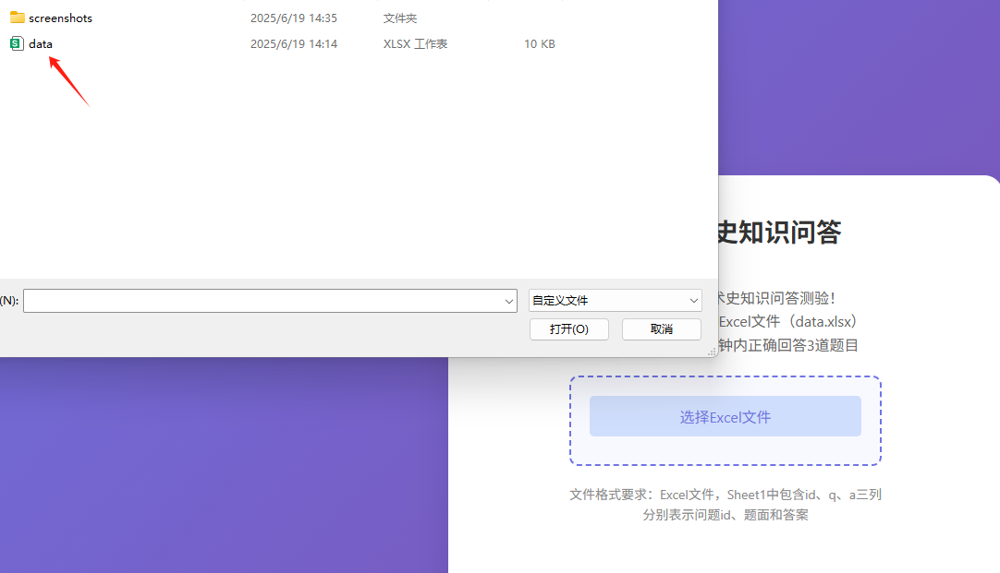

# 科学技术史知识问答测验

> 一个基于Web的互动式科学技术史知识测验应用，支持Excel文件导入题库，具有计时挑战功能。


## 📋 项目简介

这是一个专为科学技术史学习设计的在线知识问答测验系统。用户可以通过上传Excel格式的题库文件，进行限时答题挑战。系统具有简洁美观的界面设计，提供实时计时、进度跟踪等功能。

## ✨ 主要特性

- 🕐 **限时挑战**：60秒倒计时，增加答题紧迫感
- 📊 **Excel导入**：支持上传.xlsx/.xls格式的题库文件
- 🎯 **智能出题**：随机抽取题目，避免重复
- 📈 **实时反馈**：显示答题进度和正确率统计
- 🎨 **美观界面**：现代化UI设计，渐变背景和流畅动画
- 📱 **响应式设计**：支持不同屏幕尺寸的设备
- ⚡ **纯前端**：无需服务器，直接在浏览器中运行

## 🎮 游戏规则

- ⏱️ 每次测验限时60秒
- 🎯 需要正确回答3道题目才能挑战成功
- ✅ 点击"下一题"表示回答正确
- ⏭️ 点击"跳过"不计入正确答案
- 🏆 在时间内完成3道题即为挑战成功

## 🚀 快速开始

### 方法一：直接使用
1. 下载 `index.html` 文件到本地
2. 双击文件，用浏览器打开
3. 准备Excel题库文件并上传
4. 开始答题挑战！

### 方法二：克隆仓库
```bash
git clone https://github.com/SUAT-AIRI/Quiz.git
cd science-history-quiz
```

然后用浏览器打开 `index.html` 文件。

### 方法三：本地服务器（推荐）
```bash
# 使用Python
python -m http.server 8000

# 或使用Node.js
npx http-server
```

访问 `http://localhost:8000` 即可使用。

## 📁 文件结构

```
Quiz/
├── index.html          # 主应用文件
├── README.md          # 项目说明文档
├── data.xlsx          # 题库示例文件
└── screenshots/       # 应用截图
    ├── upload.png
    ├── quiz.png
    └── result.png
```

## 📊 Excel题库格式

题库文件需要是Excel格式（.xlsx或.xls），并且在Sheet1中包含以下三列：

| 列名 | 说明 | 示例 |
|------|------|------|
| id | 题目ID（唯一标识） | 1, 2, 3... |
| q | 题目内容 | "谁发明了电话？" |
| a | 答案内容 | "亚历山大·贝尔" |

### 示例数据：

| id | q | a |
|----|---|---|
| 1 | 谁发明了电话？ | 亚历山大·贝尔 |
| 2 | 牛顿的《自然哲学的数学原理》发表于哪一年？ | 1687年 |
| 3 | DNA双螺旋结构是由谁发现的？ | 沃森和克里克 |
| 4 | 第一台电子计算机ENIAC诞生于哪一年？ | 1946年 |
| 5 | 谁提出了相对论？ | 爱因斯坦 |

## 🛠️ 技术栈

- **HTML5**：页面结构和语义化标记
- **CSS3**：样式设计，包括渐变、动画和响应式布局
- **JavaScript (ES6+)**：核心逻辑和交互功能
- **SheetJS (xlsx)**：Excel文件解析库
- **File API**：浏览器文件处理接口

## 🎨 界面预览

### 上传界面
用户友好的文件上传界面，支持拖拽上传和格式验证。


### 答题界面
简洁的题目展示，清晰的按钮布局，实时的计时器和进度显示。


### 结果界面
动画效果的成功/失败提示，鼓励用户继续挑战。


## 🔧 浏览器兼容性

| 浏览器 | 版本要求 |
|--------|----------|
| Chrome | ≥ 60 |
| Firefox | ≥ 55 |
| Safari | ≥ 12 |
| Edge | ≥ 79 |

## 📝 开发指南

### 添加新功能
1. Fork 本仓库
2. 创建特性分支：`git checkout -b feature/new-feature`
3. 提交更改：`git commit -am 'Add new feature'`
4. 推送分支：`git push origin feature/new-feature`
5. 提交Pull Request

### 代码风格
- 使用2空格缩进
- 函数和变量使用驼峰命名
- 添加必要的注释说明

## 🤝 贡献

欢迎提交Issue和Pull Request来帮助改进这个项目！

### 贡献方式：
- 🐛 报告Bug
- 💡 提出新功能建议
- 📝 改进文档
- 🎨 优化界面设计
- ⚡ 性能优化

## 📄 许可证

## 🙏 致谢

- 感谢 [SheetJS](https://github.com/SheetJS/sheetjs) 提供的Excel文件处理能力
- 感谢所有为科学技术史教育事业贡献的教育工作者

⭐ 如果这个项目对你有帮助，请给个Star支持一下！